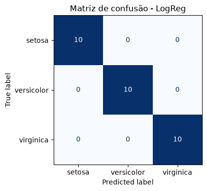
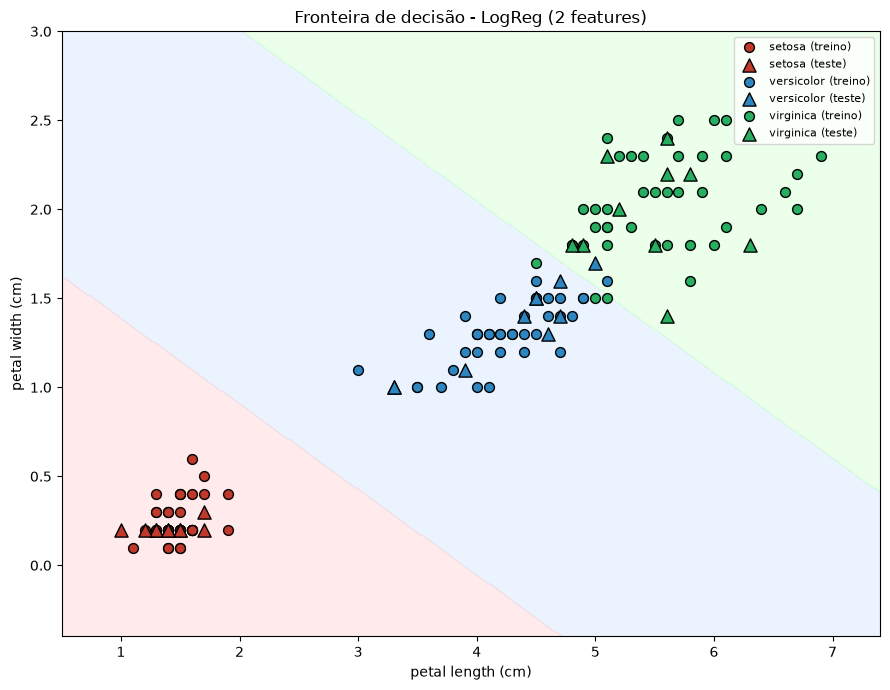

# Resultados

Seleção de modelos no IRIS com busca aleatória (RandomizedSearchCV, validação cruzada de 5 folds, métrica de acurácia). Foram 50 combinações sorteadas por modelo (30 no MLP, que demora mais). A avaliação final foi feita num hold-out estratificado de 20% (30 amostras) que ficou de fora de todo o processo de tuning. Seed fixa em 42.

## Comparação dos modelos

| Modelo | Acc CV (treino) | Acurácia (teste) | Precisão (teste) | Recall (teste) |
|---|---|---|---|---|
| Regressão Logística | 0.9667 | 1.0000 | 1.0000 | 1.0000 |
| KNN | 0.9667 | 0.9667 | 0.9697 | 0.9667 |
| Naive Bayes | 0.9500 | 0.9667 | 0.9697 | 0.9667 |
| SVM | 0.9667 | 0.9667 | 0.9697 | 0.9667 |
| Árvore de Decisão | 0.9417 | 0.9333 | 0.9333 | 0.9333 |
| MLP | 0.9667 | 0.8333 | 0.8498 | 0.8333 |

Precisão e recall com média macro, já que as 3 classes são balanceadas.

## Melhores hiperparâmetros encontrados

| Modelo | Hiperparâmetros |
|---|---|
| KNN | n_neighbors = 12 |
| Naive Bayes | não tem hiperparâmetros |
| Regressão Logística | C = 3.75e7 |
| Árvore de Decisão | max_depth = 958, max_leaf_nodes = 688, min_samples_leaf = 0.309, min_samples_split = 0.382 |
| MLP | activation = identity, hidden_layer_sizes = 32, learning_rate_init = 0.091, max_iter = 243, momentum = 0.581 |
| SVM | kernel = sigmoid, C = 73938, gamma = 0.00097, degree = 2 |

## Melhor modelo

A regressão logística acertou as 30 amostras do teste, fechando com 1.0 nas três métricas. O C gigante que a busca escolheu significa regularização praticamente nula, o que funciona bem aqui porque o IRIS é pequeno e quase linearmente separável.

Vale o disclaimer: com só 30 amostras de teste, errar uma única já derruba a acurácia para 0.9667. KNN, SVM e MLP empataram com a regressão logística na validação cruzada (0.9667), então a diferença no teste entre eles não é estatisticamente forte. O caso mais claro disso é o MLP, que teve a mesma CV de 0.9667 mas caiu para 0.8333 no teste, provavelmente porque a configuração sorteada (ativação identity com early stopping) é sensível ao split.

A árvore de decisão ficou em último na CV. As distribuições do enunciado sorteiam com frequência frações altas de min_samples_split e min_samples_leaf, o que força árvores bem rasas, então boa parte do orçamento da busca foi gasto em configurações fracas.

O Naive Bayes, sem tunar nada, empatou em 0.9667 no teste. Diz mais sobre o dataset do que sobre o modelo: a setosa se separa linearmente das outras duas classes e as features de pétala têm distribuição bem comportada dentro de cada classe.

## Fronteira de decisão (desafio)

Retreinei a regressão logística (mesmos hiperparâmetros) usando só comprimento e largura de pétala, as duas features que melhor separam as classes, para poder desenhar a fronteira no plano.

Mesmo só com essas 2 features o modelo acerta 0.9667 do teste. Os erros ficam na zona de transição entre versicolor e virginica, que é onde as duas classes se misturam de verdade.

## Reprodução

Basta executar o [selecao_modelos_iris.ipynb](selecao_modelos_iris.ipynb) do início ao fim. Como todas as seeds estão fixas, os números saem exatamente esses.
